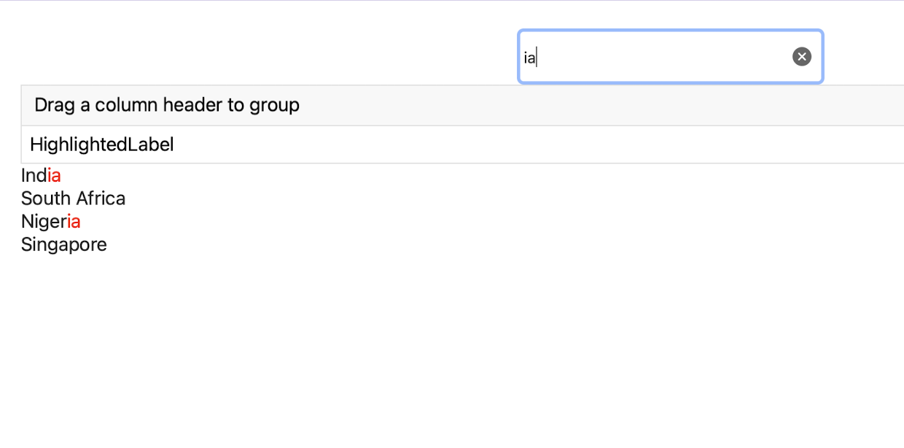

## Environment
<table>
	<tbody>
		<tr>
			<td>Product Version</td>
			<td>3.2.1</td>
		</tr>
		<tr>
			<td>Product</td>
			<td>DataGrid for MAUI</td>
		</tr>
	</tbody>
</table>


## Description

How can I have highlighted matching text from a search entry inside Telerik UI for .NET MAUI DataGrid Cell?

## Solution

This solution uses RadEntry and RadHighlighted Label to achieve the desired result.

You can use the `UnformattedText`, `HighlightText` and `HighlightTextColor` properties of RadHighlight Label to get the following result.



## Code

By Binding the `HighlightText` property to the Text Value of the Entry you will be able to get the characters which need to be highlighted. While the `UnformattedText` property should be Bound to the Property of the ItemsSource you wish to be displayed in the column

The code looks as follows:

```XAML
<telerik:RadEntry x:Name="searchEntry"
				  HeightRequest="50"
				  WidthRequest="300"
				  Placeholder="Search Entry"/>
<telerik:RadDataGrid x:Name="dataGrid" AutomationId="dataGrid" AutoGenerateColumns="False">
	<telerik:RadDataGrid.Columns>
		<telerik:DataGridTextColumn PropertyName="Country" HeaderText="HighlightedLabel">
			<telerik:DataGridTextColumn.CellContentTemplate>
				<DataTemplate>
					<telerik:RadHighlightLabel UnformattedText="{Binding Country}"
											   HighlightText="{Binding Source={x:Reference searchEntry}, Path=Text}"
											   HighlightTextColor="Red"/>
				</DataTemplate>
			</telerik:DataGridTextColumn.CellContentTemplate>
		</telerik:DataGridTextColumn>
	</telerik:RadDataGrid.Columns>
</telerik:RadDataGrid>
```