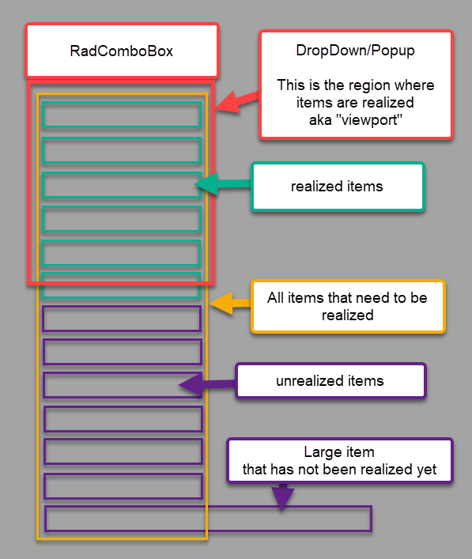

## Environment
<table>
    <tbody>
        <tr>
            <td>Product Version</td>
            <td>5.2.0</td>
        </tr>
        <tr>
            <td>Product</td>
            <td>ComboBox for MAUI</td>
        </tr>
    </tbody>
</table>


## Description

The Telerik UI for .NET MAUI ComboBox control cannot determine its maximum DropDownWidth automatically due to the UI virtualization of the ItemsControl that visualizes the items in the drop down. This how-to article describes a method to look ahead and determine the widest width needed for the dropdown by using SKPaint's `MeasureText` method.

For example, let's say the first 49 items are only five characters wide, but the 50th one is twelve characters wide. The ComboBox's dropdown will be thinner when first rendered, but get wider when the 50th item scrolls into view.

Here is a visual mockup of how such a viewport works



So, if you want the same width with the widest item, then you'll need to determine this ahead of time and set the `DropDownWidth` property to the widest value.

## Solution

In order to handle this automatically, we can look through the data for the longest string, then use SKPaint's `MeasureText` method to determine the width we'll eventually need. We can take this value, then add a little extra for the right/left padding, and apply it to RadCombobox's `DropDownWidth` property.

1. Create an AttachedProperty

To make things reusable and clean, it is recommended that you use an attached property for this approach. Create a new class named `ComboBoxHelper.cs` in the project and use the following code.

Note: 

```csharp
using System.ComponentModel;
using System.Reflection;
using SkiaSharp;
using Telerik.Maui.Controls;

#if WINDOWS
using System.Runtime.InteropServices;
using WinRT;
#endif

namespace YOUR_APP;

public class ComboBoxHelper
{
    public static readonly BindableProperty AutoWidthEnabledProperty =
        BindableProperty.CreateAttached("AutoWidthEnabled", typeof(bool), typeof(ComboBoxHelper), false, propertyChanged: AutoWidthEnabledPropertyChanged);

    public static bool GetAutoWidthEnabled(BindableObject view)
        => (bool)view.GetValue(AutoWidthEnabledProperty);

    public static void SetAutoWidthEnabled(BindableObject view, bool value)
        => view.SetValue(AutoWidthEnabledProperty, value);

    private static void AutoWidthEnabledPropertyChanged(BindableObject bindable, object oldValue, object newValue)
    {
        if (bindable is not RadComboBox comboBox) 
            return;

        if ((bool)oldValue)
        {
            comboBox.PropertyChanged -= OnComboBoxPropertyChanged;
        }

        if ((bool)newValue)
        {
            comboBox.PropertyChanged += OnComboBoxPropertyChanged;
        }

        CalculateMaxWidth(comboBox);
    }

    private static void OnComboBoxPropertyChanged(object sender, PropertyChangedEventArgs e)
    {
        if (e.PropertyName == nameof(RadComboBox.ItemsSource))
        {
            CalculateMaxWidth((RadComboBox)sender);
        }
    }

    private static async void CalculateMaxWidth(RadComboBox comboBox)
    {
        if (comboBox.ItemsSource == null)
            return;

        var width = 0.0;
        var scale = GetPixelScale();

        await Task.Run(() =>
        {
            var paint = new SKPaint
            {
                Typeface = SKTypeface.FromFamilyName(comboBox.FontFamily),
                TextSize = (float)(comboBox.FontSize * scale)
            };

            PropertyInfo prop = null;

            foreach (var item in comboBox.ItemsSource)
            {
                if (prop == null)
                {
                    prop = item.GetType().GetProperty(comboBox.DisplayMemberPath);
                }

                var text = prop.GetValue(item).ToString();
                var textWidth = paint.MeasureText(text);
                if (textWidth > width)
                {
                    width = textWidth;
                }
            }
        });
        
        // We need to add the default padding from the default Template in the calculation as well.
        // If you have custom template this values might be different.
#if MACCATALYST
        width += 27;
#elif WINDOWS
        width += 16;
#endif

        comboBox.DropDownWidth = width;
    }

    internal static double GetPixelScale()
    {
#if WINDOWS
        var mainWindow = MauiWinUIApplication.Current.Application?.Windows[0].Handler?.PlatformView?.As<IWindowNative>();
        if (mainWindow == null)
        {
            return 1;
        }

        var windowHandle = mainWindow.WindowHandle;
        var dpi = User32.GetDpiForWindow(windowHandle);
        var resolutionScale = (double)dpi / 96;
        return resolutionScale;
#elif MACCATALYST
        // Catalyst text is scaled down to 77% in macOS. For example, the system scales text font size of 17pt down to 13pt in macOS.
        return 1.33;
#endif

        return 1;
    }
}

#if WINDOWS
internal static partial class User32
{
    [DllImport(nameof(User32))]
    public static extern int GetDpiForWindow(IntPtr hwnd);
}

[ComImport]
[InterfaceType(ComInterfaceType.InterfaceIsIUnknown)]
[Guid("EECDBF0E-BAE9-4CB6-A68E-9598E1CB57BB")]
internal interface IWindowNative
{
    IntPtr WindowHandle { get; }
}
#endif
```

Take notice that the `var textWidth = paint.MeasureText(text)` code is what eventually gets that widest-width value for you.

1. Now you can use the attached property on any `RadComboBox` instance

```xaml
<ContentPage xmlns="http://schemas.microsoft.com/dotnet/2021/maui"
             xmlns:x="http://schemas.microsoft.com/winfx/2009/xaml"
             xmlns:telerik="http://schemas.telerik.com/2022/xaml/maui"
             xmlns:local="clr-namespace:YOUR_APP"
             x:Class="YOUR_APP.MainPage">
    <VerticalStackLayout>
        <telerik:RadComboBox x:Name="MyComboBox1"
                             DisplayMemberPath="Name"
                             local:ComboBoxHelper.AutoWidthEnabled="True"/>
    </VerticalStackLayout>
</ContentPage>
```

## Notes

- This is an example as a place to start, the code is written for Windows and MacCatalyst but you can expand it to other platforms as needed.
- This will not work if you have defined a custom `ItemTemplate` for the dropdown. You can still use it as an inpiration to determine the width for your ItemTemplate's root element (or just set a minimum width instead).