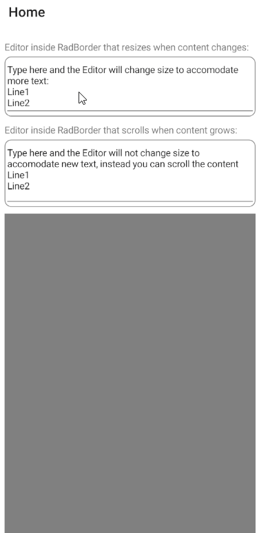

## Environment

| Product |
| --- |
| Editor for .NET MAUI |

## Description

I want the <a href="https://learn.microsoft.com/en-us/dotnet/maui/user-interface/controls/editor?view=net-maui-8.0" target="_blank">`Editor` for .NET MAUI</a> to scroll on Android when added inside a `ScrollView`.

This KB article also answers the following questions:
- How to use the .NET MAUI `Editor`, so the editor to scroll when having more input elements on the page?
- How to use the .NET MAUI `Editor`, so the editor to resize to accommodate new input?
- How to make the scenarios described above to work correctly when wrapping the .NET MAUI `Editor` inside a Border?

## Solution

To scroll the .NET MAUI `Editor` on Android when the editor is inside `ScrollView` you need to use the editor handler to access the native Android control. Then call the  `RequestDisallowInterceptTouchEvent` with parameter `false` to the parent view the editor is placed to. 

Use the Telerik .NET MAUI [RadBorder]() to achieve the following:

* `Editor` inside `RadBorder` that resizes when content changes.
* `Editor` inside `RadBorder` that scrolls when content grows.

### Example

Here is an example that solves the questions described above:

**1.** Define the custom editor in C#:

```C#
public class CustomEditor : Editor
{

}
```

**2.** Define the editor handler:

```C#
public class CustomEditorHandler : EditorHandler
{
#if ANDROID
    protected override AppCompatEditText CreatePlatformView()
    {
        var platfromView = base.CreatePlatformView();
        platfromView.SetOnTouchListener(new CustomTouchListener());
        return platfromView;
    }

    class CustomTouchListener : Java.Lang.Object, IOnTouchListener
    {
        public bool OnTouch(Android.Views.View? v, MotionEvent? e)
        {
            v?.Parent?.RequestDisallowInterceptTouchEvent(true);
            if ((e.Action & MotionEventActions.Up) != 0 &&
                (e.ActionMasked & MotionEventActions.Up) != 0)
            {
                v?.Parent?.RequestDisallowInterceptTouchEvent(false);
            }

            return false;
        }
    }
#endif
}

```

**3.** To resize the editor to accommodate new inputs set its `AutoSize` property to `TextChanges`. 

```XAML
<local:CustomEditor AutoSize="TextChanges" />
```

**4.** Wrap the .NET MAUI `Editor` in [RadBorder]() control and place the border inside `ScrollView`:

```XAML
<ScrollView>
    <Grid RowDefinitions="Auto, Auto, *" Padding="10,5">
        <Label Text="Editor inside RadBorder that resizes when content changes:"/>
        <telerik:RadBorder x:Name="border" 
                            Grid.Row="1"
                            BorderColor="Gray" 
                            CornerRadius="10" 
                            BorderThickness="1">
            <local:CustomEditor AutoSize="TextChanges" 
                                Text="Type here and the Editor will change size to accomodate more text: &#xa;Line1&#xa;Line2" />
        </telerik:RadBorder>
            
        <VerticalStackLayout Grid.Row="2">
            <Label Text="Editor inside RadBorder that scrolls when content grows:"/>
            <telerik:RadBorder BorderColor="Gray" 
                                BorderThickness="1" 
                                CornerRadius="10" 
                                HeightRequest="100">
                <local:CustomEditor Text="Type here and the Editor will not change size to accomodate new text, instead you can scroll the content&#xa;Line1&#xa;Line2" />
            </telerik:RadBorder>

            <BoxView Margin="0,10,0,0" Color="Gray" HeightRequest="1000"/>
        </VerticalStackLayout>
    </Grid>
</ScrollView>
```

This is the result:


