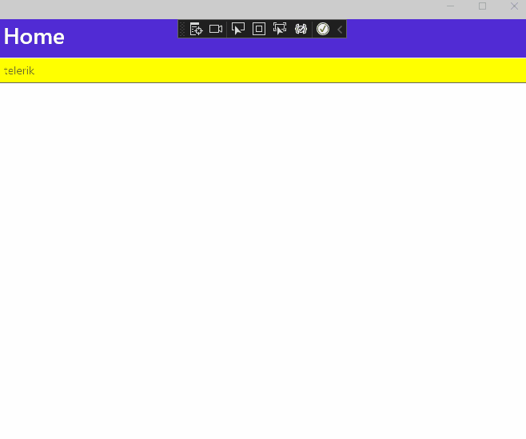

## Environment

<table>
	<tbody>
    <tr>
      <td>Product</td>
      <td>Progress® Telerik® UI for .NET MAUI Entry</td>
    </tr>
  	<tr>
  		<td>Product Version</td>
  		<td>5.1.0</td>
  	</tr>
	</tbody>
</table>


## Description

How can I set the visual states of the Telerik UI for .NET MAUI Entry control?

## Solution

To set the visual states of the Entry control, use the `RadEntry` class, which inherits them from the Entry, and the concept of the visual states, which is introduced by the `VisualStateManager` configuration. `VisualStateManager` defines a visual state group named `CommonStates` and supports the `Normal`, `Disabled`, `Focused`, `Selected`, and `PointerOver` values. It is recommended that you add configurations for all visual states that are available.

```XAML
<telerik:RadEntry x:Name="tEntry" Placeholder="telerik">
    <VisualStateManager.VisualStateGroups>
        <VisualStateGroupList>
            <VisualStateGroup x:Name="CommonStates">
                <VisualState x:Name="Normal">
                    <VisualState.Setters>
                        <Setter Property="FontSize" Value="35" />
                    </VisualState.Setters>
                </VisualState>
                <VisualState x:Name="Focused">
                    <VisualState.Setters>
                        <Setter Property="BackgroundColor" Value="Red" />
                    </VisualState.Setters>
                </VisualState>
                <VisualState x:Name="Disabled">
                    <VisualState.Setters>
                        <Setter Property="BackgroundColor" Value="Pink" />
                    </VisualState.Setters>
                </VisualState>
                <VisualState x:Name="Unfocused">
                    <VisualState.Setters>
                        <Setter Property="BackgroundColor"  Value="yellow" />
                    </VisualState.Setters>
                </VisualState>
                <VisualState x:Name="PointerOver"/>
            </VisualStateGroup>
        </VisualStateGroupList>
    </VisualStateManager.VisualStateGroups>
</telerik:RadEntry>
```


The following `.gif` file represents the result from the code snippet:


