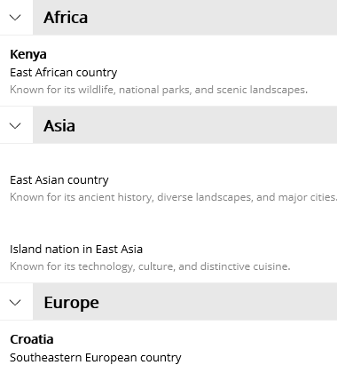
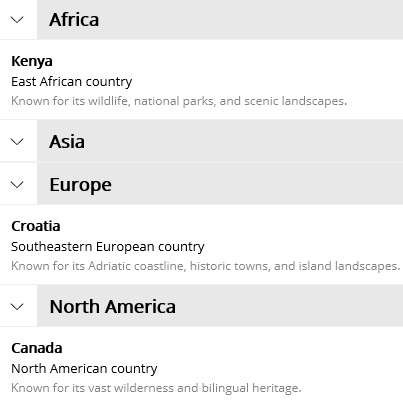

## Environment

| Version | Product | Author | 
| --- | --- | ---- | 
| 15.0.0 | Telerik UI for .NET MAUI CollectionView | [Desislava Yordanova](https://www.telerik.com/blogs/author/desislava-yordanova) | 

## Description

When displaying grouped data in the .NET MAUI CollectionView, some items may have empty or `null` values for specific properties (for example, a country's `Name`). When rendering these items, the goal is to completely collapse and hide them so that only valid items and group headers are displayed, without empty items occupying vertical or horizontal space.

This knowledge base article also answers the following questions:
- How do I hide items with empty or null property values in a grouped RadCollectionView?
- How to prevent empty items from occupying space in .NET MAUI CollectionView?
- How can I apply `DataTrigger` to `RadCollectionViewItemView` in C# to collapse empty item containers?

## Solution

To completely hide an item and eliminate any layout space it occupies within a `RadCollectionView`, target the item container itself (`RadCollectionViewItemView`) via `ItemViewStyle`. If you only hide the visual elements inside `ItemTemplate`, the parent `RadCollectionViewItemView` container will still preserve its default padding and dimensions.

1. Apply a `DataTrigger` directly to `RadCollectionViewItemView` for both `null` and `string.Empty` values that resets `IsVisible`, `HeightRequest`, `MinimumHeightRequest`, `WidthRequest`, `MinimumWidthRequest`, and `Padding` to `0`. Here is the XAML definition of the `RadCollectionView` and `ItemViewStyle` with the `Triggers`:

```XAML
<ContentPage.Resources>
    <ResourceDictionary>
        <Style x:Key="CountryItemStyle" TargetType="telerik:RadCollectionViewItemView">
            <Style.Triggers>
                <DataTrigger TargetType="telerik:RadCollectionViewItemView"
                                Binding="{Binding Name}"
                                Value="{x:Null}">
                    <Setter Property="IsVisible" Value="False" />
                    <Setter Property="HeightRequest" Value="0" />
                    <Setter Property="MinimumHeightRequest" Value="0" />
                    <Setter Property="WidthRequest" Value="0" />
                    <Setter Property="MinimumWidthRequest" Value="0" />
                    <Setter Property="Padding" Value="0" />
                </DataTrigger>
                <DataTrigger TargetType="telerik:RadCollectionViewItemView"
                                Binding="{Binding Name}"
                                Value="">
                    <Setter Property="IsVisible" Value="False" />
                    <Setter Property="HeightRequest" Value="0" />
                    <Setter Property="MinimumHeightRequest" Value="0" />
                    <Setter Property="WidthRequest" Value="0" />
                    <Setter Property="MinimumWidthRequest" Value="0" />
                    <Setter Property="Padding" Value="0" />
                </DataTrigger>
            </Style.Triggers>
        </Style>
    </ResourceDictionary>
</ContentPage.Resources>
<telerik:RadCollectionView x:Name="CountriesCollectionView"
                            ItemsSource="{Binding Countries}"
                            ItemViewStyle="{StaticResource CountryItemStyle}">
    <telerik:RadCollectionView.GroupDescriptors>
        <telerik:PropertyGroupDescriptor PropertyName="Continent" />
    </telerik:RadCollectionView.GroupDescriptors>
    <telerik:RadCollectionView.ItemTemplate>
        <DataTemplate x:DataType="local:CountryOption">
            <VerticalStackLayout Margin="10,5">
                <Label Text="{Binding Name}" FontAttributes="Bold" />
                <Label Text="{Binding ShortDescription}" />
                <Label Text="{Binding LongDescription}" TextColor="Gray" FontSize="10" />
            </VerticalStackLayout>
        </DataTemplate>
    </telerik:RadCollectionView.ItemTemplate>
    <telerik:RadCollectionView.GroupHeaderTemplate>
        <DataTemplate>
            <Label BackgroundColor="LightGray" Padding="10"
                   TextColor="Black"
                    Text="{Binding Key}" FontAttributes="Bold"
                    VerticalTextAlignment="Center" />
        </DataTemplate>
    </telerik:RadCollectionView.GroupHeaderTemplate>
</telerik:RadCollectionView>
```

2. Define sample data model and `ViewModel`:

```csharp
public class CountryOption
{
    public CountryOption(string name, string shortDescription, string longDescription, string continent)
    {
        Name = name;
        ShortDescription = shortDescription;
        LongDescription = longDescription;
        Continent = continent;
    }

    public string Name { get; set; }
    public string ShortDescription { get; set; }
    public string LongDescription { get; set; }
    public string Continent { get; set; }
}

public class MainViewModel
{
    public IReadOnlyList<CountryOption> Countries { get; } =
    [
        new("Canada", "North American country", "Known for its vast wilderness and bilingual heritage.", "North America"),
        new("Chile", "South American country", "Known for its long Pacific coastline, deserts, and Andes mountains.", "South America"),
        new("", "East Asian country", "Known for its ancient history, diverse landscapes, and major cities.", "Asia"),
        new("Colombia", "Northwestern South American country", "Known for its coffee, Caribbean coast, and vibrant cultural traditions.", "South America"),
        new("Costa Rica", "Central American country", "Known for its rainforests, biodiversity, and commitment to conservation.", "North America"),
        new("Croatia", "Southeastern European country", "Known for its Adriatic coastline, historic towns, and island landscapes.", "Europe"),
        new("", "Island nation in East Asia", "Known for its technology, culture, and distinctive cuisine.", "Asia"),
        new("Kenya", "East African country", "Known for its wildlife, national parks, and scenic landscapes.", "Africa"),
        new("Brazil", "Largest country in South America", "Known for the Amazon rainforest, vibrant cities, and Carnival.", "South America"),
        new("New Zealand", "South Pacific island country", "Known for dramatic landscapes and its outdoor adventure culture.", "Oceania")
    ];
}
```

3. This is the result:

The following table compares the `RadCollectionView` before and after applying the style to collapse empty items:

| Before (Empty items take up space) | After (Empty items hidden without taking space) |
| --- | --- |
|  |  |

## See Also

- [CollectionView Overview]()
- [Grouping Overview in CollectionView]()
- [Filtering in CollectionView]()
