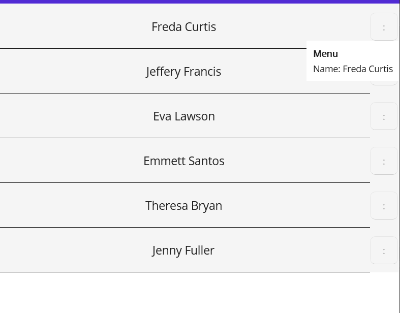

## Environment

| Version | Product | Author | 
| --- | --- | ---- | 
| 4.0.0 | Telerik UI for .NET MAUI ListView | [Dobrinka Yordanova](https://www.telerik.com/blogs/author/dobrinka-yordanova)| 

## Description

How can I add a context menu to a Telerik UI for .NET MAUI ListView item?

## Solution

A possible approach to achieve the desired scenario is to use the [Telerik UI for .NET MAUI Button]() and [Popup]() control.

**1.** Create a business model for the items:

```C#
public class DataItem : Telerik.Maui.Controls.NotifyPropertyChangedBase
{
    private string name;
    private bool isPopupOpen;

    public DataItem(string personName)
    {
        Name = personName;
    }

    public string Name
    {
        get => name;
        set => UpdateValue(ref name, value);
    }

    public bool IsPopupOpen
    {
        get => isPopupOpen;
        set => UpdateValue(ref isPopupOpen, value);
    }
}
```

**2.** In the `ViewModel`, create some sample names to populate the data source and add a command that will toggle the `IsPopupOpen` property of that item (the command opens the context menu):

```C#
public class ViewModel
{
    public ViewModel()
    {
        this.People = new ObservableCollection<DataItem>()
        {
            new DataItem("Freda Curtis"),
            new DataItem("Jeffery Francis"),
            new DataItem("Eva Lawson"),
            new DataItem("Emmett Santos"),
            new DataItem("Theresa Bryan"),
            new DataItem("Jenny Fuller")
        };

        OpenContextMenuCommand = new Command<DataItem>(item => item.IsPopupOpen = !item.IsPopupOpen);
    }

    public ObservableCollection<DataItem> People { get; set; }
    public Command<DataItem> OpenContextMenuCommand { get; }
}
```

**3.** Add the code in XAML. It uses a `RadPopup` in the `ItemTemplate` with a slight offset and provides the takeaways:

  * The `IsOpen` property of the control is bound to the `IsPopupOpen` property of the model.
  * The `Command` of the Button uses `x:Reference` to get to the `command` property of the `ViewModel`.

```XAML
<ContentPage xmlns="http://schemas.microsoft.com/dotnet/2021/maui"
             xmlns:x="http://schemas.microsoft.com/winfx/2009/xaml"
             xmlns:telerik="http://schemas.telerik.com/2022/xaml/maui"
             xmlns:local="clr-namespace:TESTNet7"
             x:Class="TESTNet7.MainPage">
    <ContentPage.BindingContext>
        <local:ViewModel x:Name="PageViewModel" />
    </ContentPage.BindingContext>

    <Grid>
        <telerik:RadListView x:Name="listView"
                                         ItemsSource="{Binding People}"
                                         SelectionMode="None">
            <telerik:RadListView.ItemTemplate>
                <DataTemplate>
                    <telerik:ListViewTemplateCell>
                        <Grid x:Name="ItemGrid"
                              BackgroundColor="WhiteSmoke"
                              HeightRequest="70">
                            <Grid.ColumnDefinitions>
                                <ColumnDefinition Width="*" />
                                <ColumnDefinition Width="45" />
                            </Grid.ColumnDefinitions>

                            <Label x:Name="ListItemDisplayLabel"
                                   Text="{Binding Name}"
                                   HorizontalOptions="Center"
                                   VerticalOptions="Center"
                                   FontSize="18" />

                            <BoxView x:Name="ItemSpacerBoxView"
                                     HorizontalOptions="Fill"
                                     VerticalOptions="End"
                                     HeightRequest="1" />

                            <!-- If you want just the ellipsis to open the context menu, use a Button instead.
                                 Since the command is in the page's ViewModel, so we use x:Reference to escape the BindingContext of the DataTemplate -->
                            <Button Text=":"
                                    Command="{Binding BindingContext.OpenContextMenuCommand, Source={x:Reference listView}}"
                                    CommandParameter="{Binding}"
                                    TextColor="DarkGray"
                                    BackgroundColor="Transparent"
                                    VerticalOptions="Center"
                                    HorizontalOptions="Center"
                                    Grid.Column="1">
                                <telerik:RadPopup.Popup>
                                    <!-- The BindingContext of the popup is the item, so we can bind to IsPopupOpen and Name. -->
                                    <telerik:RadPopup IsOpen="{Binding IsPopupOpen}"
                                                                HorizontalOffset="-25">
                                        <StackLayout BackgroundColor="White"
                                                     Padding="10"
                                                     Spacing="5">
                                            <Label Text="Menu" FontAttributes="Bold"/>
                                            <Label Text="{Binding Name, StringFormat='Name: {0}'}" />
                                        </StackLayout>
                                    </telerik:RadPopup>
                                </telerik:RadPopup.Popup>
                            </Button>
                        </Grid>
                    </telerik:ListViewTemplateCell>
                </DataTemplate>
            </telerik:RadListView.ItemTemplate>
        </telerik:RadListView>
    </Grid>
</ContentPage>
```

The following image shows the final result.


