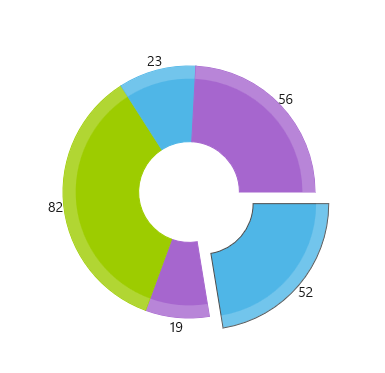

## Environment

| Version | Product | Author | 
| --- | --- | ---- | 
| 10.0.0 | PieChart for .NET MAUI | [Dobrinka Yordanova](https://www.telerik.com/blogs/author/dobrinka-yordanova)| 


## Description

I want to change the default colors of the PieChart for donut or pie series.

This knowledge base article also answers the following questions:
- How can I use custom colors in the Telerik UI for .NET MAUI PieChart?
- How can I change the color on the Telerik `DonutSeries` or `PieSeries`?

## Solution

The PieChart supports the following default set of colors for displaying its data points:

* `#0078D4`
* `#EA005E`
* `#60CCFE`
* `#0093F9`
* `#00B7C3`
* `#FFB900`
* `#C239B3`
* `#6B69D6`

To modify the default built-in colors, implement a custom palette, as demonstrated in the following scenario:

**1.** Create a sample  `DataModel`:

<snippet id='categorical-data-model'/>

**2.** Define the `ViewModel` class:

```C#
public class ViewModel
{
	public ObservableCollection<CategoricalData> Data { get; set; }

	public ViewModel()
	{
		this.Data = GetCategoricalData();
	}

	private static ObservableCollection<CategoricalData> GetCategoricalData()
	{
		var data = new ObservableCollection<CategoricalData>
		{
			new CategoricalData { Category = "Greenings", Value = 52 },
			new CategoricalData { Category = "Perfecto", Value = 19 },
			new CategoricalData { Category = "NearBy", Value = 82 },
			new CategoricalData { Category = "Family", Value = 23 },
			new CategoricalData { Category = "Fresh", Value = 56 },
		};
		return data;
	}
}
```

**3.** Define the `RadPieChart` with `DonutSeries` in XAML:

```XAML
<telerik:RadPieChart HeightRequest="400" WidthRequest="300">
	<telerik:RadPieChart.BindingContext>
		<local:ViewModel />
	</telerik:RadPieChart.BindingContext>
	<telerik:RadPieChart.Palette>
		<telerik:ChartPalette>
			<telerik:ChartPalette.Entries>
				<telerik:PaletteEntry FillColor="#4FB6E7" StrokeColor="#4FB6E7" />
				<telerik:PaletteEntry FillColor="#A666CE" StrokeColor="#A666CE" />
				<telerik:PaletteEntry FillColor="#9DCC00" StrokeColor="#9DCC00" />
			</telerik:ChartPalette.Entries>
		</telerik:ChartPalette>
	</telerik:RadPieChart.Palette>
	<telerik:RadPieChart.SelectionPalette>
		<telerik:ChartPalette>
			<telerik:ChartPalette.Entries>
				<telerik:PaletteEntry FillColor="#4FB6E7" StrokeColor="#4D4D4D" />
				<telerik:PaletteEntry FillColor="#A666CE" StrokeColor="#4D4D4D" />
				<telerik:PaletteEntry FillColor="#9DCC00" StrokeColor="#4D4D4D" />
			</telerik:ChartPalette.Entries>
		</telerik:ChartPalette>
	</telerik:RadPieChart.SelectionPalette>
	<telerik:RadPieChart.Series>
		<telerik:DonutSeries ShowLabels="True"
                    InnerRadiusFactor="0.4"
                    ValueBinding="Value"
                    ItemsSource="{Binding Data}" />
	</telerik:RadPieChart.Series>
	<telerik:RadPieChart.ChartBehaviors>
		<telerik:ChartSelectionBehavior DataPointSelectionMode="Single"  />
	</telerik:RadPieChart.ChartBehaviors>
</telerik:RadPieChart>
```

**4.** Add the `telerik` namespace: 

```XAML
xmlns:telerik="http://schemas.telerik.com/2022/xaml/maui"
```

The following image shows the end result of the suggested implementation.



