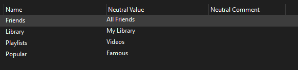
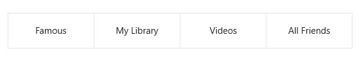

## Environment

| Version | Product |
| ------- | ------- |
| 9.0.0 | Telerik UI for .NET MAUI SegmentedControl |

## Description

When working with the [SegmentedControl]() for .NET MAUI, you might need to localize the text displayed in each segment.

This knowledge base article also answers the following questions:

* How to localize the text when the control's `ItemsSource` is an `Array` of `strings`?
* How to use a resource (`.resx`) file for localization?
* How to localize strings in an array?

## Solution

To localize the text inside the segments of the SegmentedControl: 

**1.** [Create a `.resx` file](https://learn.microsoft.com/en-us/dotnet/maui/fundamentals/localization?view=net-maui-9.0#create-resource-files-to-store-strings) to store the strings. In the example below, the `.resx` file is named `MyResource`.



The resource file contains the following information for each item:

* `Name`&mdash;Specifies the key used to access the text in code.
* `NeturalValue`&mdash;Specifies the translated text.

**2.** In XAML, access the generic static properties in the `SegmentedControl.ItemsSource` by using the `x:Static` markup extension:

```XAML
<telerik:RadSegmentedControl x:Name="segmentControlText"
                             HeightRequest="60"
                             VerticalOptions="Start">
    <telerik:RadSegmentedControl.ItemsSource>
        <x:Array Type="{x:Type x:String}">
            <x:Static Member="local:MyResource.Popular"/>
            <x:Static Member="local:MyResource.Library"/>
            <x:Static Member="local:MyResource.Playlists"/>
            <x:Static Member="local:MyResource.Friends"/>
        </x:Array>
    </telerik:RadSegmentedControl.ItemsSource>
</telerik:RadSegmentedControl>
```

**3.** Add the following namespaces:

```XAML
xmlns:telerik="http://schemas.telerik.com/2022/xaml/maui"
xmlns:local="clr-namespace:YourNamespace"
```

This is the result when applying localization for segments:



## See Also

- [SegmentedControl Overview](
- [.NET MAUI Localization](https://learn.microsoft.com/en-us/dotnet/maui/fundamentals/localization?view=net-maui-9.0)
