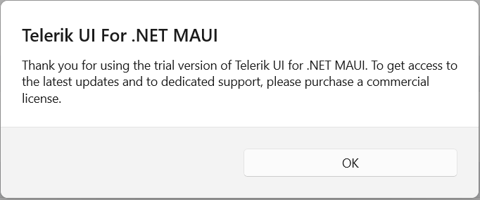

## Environment

| Version | Product | Author | 
| --- | --- | ---- | 
| All versions | Telerik UI for .NET MAUI |[Dobrinka Yordanova](https://www.telerik.com/blogs/author/dobrinka-yordanova)| 

## Description

While using a trial license, a trial message is rendered over the components and there is an alter with the following message:

If you have a commercial license, but you still see the trial message, try the following steps:

1. Ensure that the licensed package is referenced in the project (`Telerik.UI.for.Maui` instead of `Telerik.UI.for.Maui.Trial`).

1. Uninstall any Trial installations from the machine.

1. If you have created local NuGet feeds, ensure they do not contain Trial versions of our packages.

1. <a href="https://docs.microsoft.com/en-us/nuget/consume-packages/managing-the-global-packages-and-cache-folders#clearing-local-folders" target="_blank">Clean the NuGet packages</a> on the machine.

1. Clean the projects.

1. Delete the `bin` and `obj` folders where packages and assemblies may be cached.

1. Re-build your project.