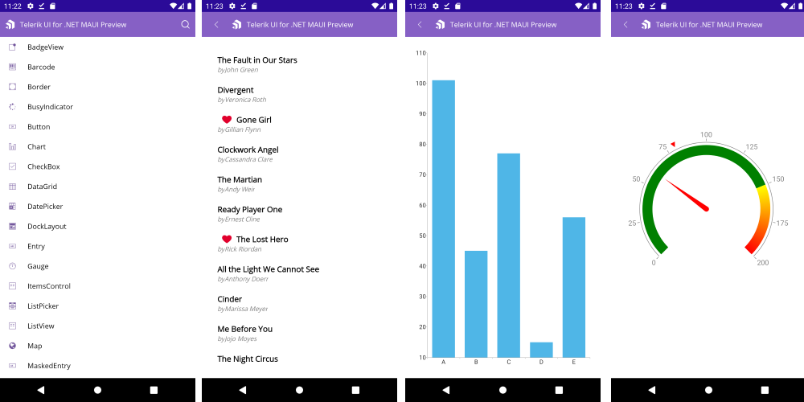

#  Telerik UI for MAUI Demo Application

## Download the Demo App

**1. Log into your [Telerik account](https://www.telerik.com/account/).**

**2. Click on the __Downloads__ tab:**

**3. Select Telerik UI for MAUI product title:**

**4. The next page allows you to download the Automatic Installation msi file**

**3. Install** Telerik_UI_for_Maui_[version]_Preview.msi - runnable msi file used for automatic installation (for use on PC).

Run the MSI file and follow the instructions. On a 32bit machine the wizard will install the UI for Xamarin component in the following folder unless you specify otherwise: C:\Program Files\Telerik\ or C:\Program Files (x86)\Telerik\ for a 64bit machine.

The Installation folder has the following structure:

* Binaries - Contains the needed dlls for Android and iOS 
* **DemoApp - Dempo App with Telerik UI for .NET MAUI controls**
* LicenseAgreements - provides the product EULA.
* Packages - Telerik_UI_for_Maui_[version]_Preview.nupkg file

**4. Open the DemoApp.sln file in Visual Studio**

## See Also

* [Border]()
* [Button]()
* [Chart]()
* [ItemsControl]()
