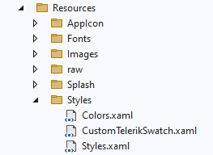
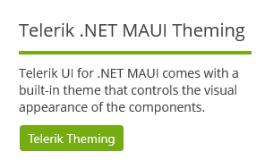

# Customizing a Theme

The Telerik UI for .NET MAUI themes are flexible and allow you to customize and adjust them to meet the specific application requirements.

Depending on the changes that you want to apply, you can customize the appearance of the Telerik UI for .NET MAUI controls in a couple of ways:
* You can modify only the colors in a certain color variation (swatch)&mdash;this will affect all the Telerik UI controls.
* You can change the styles and templates for a specific Telerik UI control.

Both customization approaches require the following steps:

1. Copying the needed resources in a separate resource dictionary and modifying them.
2. Merging the modified resource dictionary after the Telerik theme resources.

Before proceeding with the next steps, make sure the [Telerik Theming is enabled](#using-the-telerik-theming).

## Copying and Modifying the Theme Resources

All available theme styles are in the `TelerikTheming` folder:
* The color variations are in the `Swatches` folder.
* The styles and templates for the Telerik UI for .NET MAUI controls are in the `Styles` folder.

To modify the theme resources:

1. Go to the `Resources/Styles` folder and create a `ResourceDictionary` file without a code-behind file, similar to the default `Styles.xaml` and `Colors.xaml`:



2. Copy the needed colors or styles from the swatch that you need to modify and paste them into the newly created `ResourceDictionary` file. Apply the required changes based on your design requirements. For example, you can modify the primary colors of a swatch:

```XAML
<?xml version="1.0" encoding="UTF-8" ?>
<?xaml-comp compile="true" ?>
<ResourceDictionary 
    xmlns="http://schemas.microsoft.com/dotnet/2021/maui"
    xmlns:x="http://schemas.microsoft.com/winfx/2009/xaml"
    xmlns:telerik="http://schemas.telerik.com/2022/xaml/maui">

    <!-- Primary -->
    <Color x:Key="RadPrimarySubtleColor">#D0E3EE</Color>
    <Color x:Key="RadPrimarySubtleHoverColor">#B8D5E6</Color>
    <Color x:Key="RadPrimarySubtleActiveColor">#A0C7DE</Color>
    <Color x:Key="RadPrimaryColor">#74AC12</Color>
    <Color x:Key="RadPrimaryHoverColor">#689B10</Color>
    <Color x:Key="RadPrimaryActiveColor">#5D8A0E</Color>
    <Color x:Key="RadPrimaryEmphasisColor">#ACCD71</Color>
    <Color x:Key="RadPrimaryOnSubtleColor">#2E4507</Color>
    <Color x:Key="RadOnPrimaryColor">#FFFFFF</Color>
    <Color x:Key="RadPrimaryOnSurfaceColor">#74AC12</Color>

    <telerik:ColorFilter x:Key="RadPrimaryColorAlpha4" Color="{StaticResource RadPrimaryColor}" Alpha="0.04" />
    <telerik:ColorFilter x:Key="RadPrimaryColorAlpha16" Color="{StaticResource RadPrimaryColor}" Alpha="0.16" />
    <telerik:ColorFilter x:Key="RadPrimaryColorDarken4" Color="{StaticResource RadPrimaryColor}" Lighten="-0.04" />
    <telerik:ColorFilter x:Key="RadPrimaryColorDarken12" Color="{StaticResource RadPrimaryColor}" Lighten="-0.12" />
</ResourceDictionary>
```

## Merging the New Resource Dictionary in App.xaml

Once you customize the colors and styles, add the new resource dictionary to the `App.xaml` and make sure you merge `CustomTelerikSwatch.xaml` аfter the `TelerikTheming` file:

```XAML
<Application.Resources>
    <ResourceDictionary>
        <ResourceDictionary.MergedDictionaries>
            <ResourceDictionary Source="Resources/Styles/Colors.xaml" />
            <ResourceDictionary Source="Resources/Styles/Styles.xaml" />
            <local:TelerikTheming />

            <!-- Customize a swatch -->
            <ResourceDictionary Source="Resources/Styles/CustomTelerikSwatch.xaml" />
        </ResourceDictionary.MergedDictionaries>
    </ResourceDictionary>
</Application.Resources>
```

Here is the result:



## Customizing a Specific Control

To modify the Style or ControlTemplate of a certain control, for example `RadComboBox`:

1. Copy the styles and templates from the `ComboBox.xaml` file and paste them into a newly created `ResourceDictionary` file inside `Resources/Styles` folder as in [Copying and Modifying the Theme Resources](#copying-and-modifying-the-theme-resources). Make the needed changes of the ComboBox in that resource dictionary.

1. Merge the new `ResourceDictionary` inside `App.xaml` after the `TelerikTheming` file - the changes will affect all the `RadComboBox` instances across the app.

Some of the controls' XAML files have dependencies on other XAML files, you can check this inside the constructor of that file, for example, the `ComboBox.xaml` has a dependency on `Core.xaml`:

```C#
public partial class ComboBox : ResourceDictionary
{
	public ComboBox(ResourceDictionary core)
	{
		this.MergedDictionaries.Add(core);
		InitializeComponent();
	}
}
```

In this case, to modify the ComboBox, you'd need to copy and merge the content of both `Core.xaml` and `ComboBox.xaml` files.

## See Also

- [Theming Overview]()
