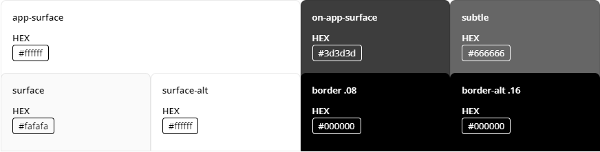

# Theming Overview

Telerik UI for .NET MAUI comes with a built-in theme that controls the visual appearance of the components, including colors, borders, backgrounds, size, layout, position, and font size. The theme also offers multiple color variations to choose from.

>caption In This Article

* [Definitions for *theme* and *swatch*](#basics)
* How to [use the Telerik theme in your app](#using-the-telerik-theming)

## Basics

### Theme

A *theme* is a collection of styles and templates in XAML files, which determine the appearance of the Telerik .NET MAUI components, including fonts, colors, sizes and layouts.

### Swatch

A *theme swatch* is a color variation of a theme. All swatches of a given theme use the same fonts, sizes, and layouts. On the other hand, the text colors, background colors and border colors are different. For example, *Purple* and *Purple Dark* are two built-in swatch names.

The Telerik .NET MAUI theme comes with a set of 8 predefined swatches for both dark and light modes: `Main`, `Main Dark`, `Ocean Blue`, `Ocean Blue Dark`, `Purple`, `Purple Dark`, `Turquoise` and `Turquoise Dark`.

Here is an example of the AutoComplete control with `Purple` and `Purple Dark` applied:


### Comparing Swatches

You can explore and compare the built-in theme swatches in the [Telerik .NET MAUI ControlsSamples App](). Go to the Theming example of each component and use the "Change Theme" dropdown to switch between the theme swatches.

## Using the Telerik Theming

To enable the Telerik Theming in your app, follow the steps below (assuming you already have a .NET MAUI app set up to work with Telerik .NET MAUI controls):

**1.** Go to the `.csproj` file of your MAUI project and set `UseTelerikTheming` property to `true` in a separate `PropertyGroup`:

```XAML
<PropertyGroup>
	<UseTelerikTheming>true</UseTelerikTheming>
</PropertyGroup>
```

**2.** Rebuild the solution - this will generate a new **TelerikTheming** folder inside the project containing all the styles and resources needed for the Telerik .NET MAUI controls:


* **Colors** folder contains the resources needed for each theme swatch in separate `ResourceDictionaries`:

    

* **Styles** folder contains the styles and templates of the Telerik .NET MAUI controls (colors are references through `DynamicResources`, so they can be updated at runtime).

**3.** Go to `App.xaml` file of your app and add the `TelerikTheming` resource dictionary to the application resources:

```XAML
<Application.Resources>
    <ResourceDictionary>
        <ResourceDictionary.MergedDictionaries>
            <ResourceDictionary Source="Resources/Styles/Colors.xaml" />
            <ResourceDictionary Source="Resources/Styles/Styles.xaml" />
            <local:TelerikTheming />
        </ResourceDictionary.MergedDictionaries>
    </ResourceDictionary>
</Application.Resources>
```

>important The files inside the **TelerikTheming** folder are auto-generated. Use them only as a reference, do not modify the resources directly here.

**4.** Set the `Telerik` theme and one of its color variations inside `App.xaml.cs` file:

```C#
var telerikTheming = Application.Current
                    .Resources
                    .MergedDictionaries
                    .OfType<TelerikTheming>()
                    .Single();
telerikTheming.Theme = TelerikTheming.Themes
                    .Single(t => t.Theme == "Telerik" && t.Swatch == "Purple");
```

This applies the `Telerik` theme with `Purple` color variation to all the supported Telerik .NET MAUI components used across the app.

For example, for `RadToggleButton` defined like this:

```XAML
<telerik:RadToggleButton x:Name="toggleButton"
                         Content="Wi-Fi" />
```

The result is:


>Keep in mind some of the Telerik UI for .NET MAUI controls do not fully support the Telerik Theming - AIPrompt, Chart, DataPager, ImageEditor, SlideView and Toolbar.

### Using the Theming Color System

Telerik .NET MAUI Theming is influenced by the [Progress Design System Kit](https://www.telerik.com/design-system/docs/) and provides the [Color System](https://www.telerik.com/design-system/docs/foundation/color/) part of the kit foundation. 

Each swatch includes Color resources which can be mapped to the color variable groups described in the [Color Swatch of the Design System Kit](https://www.telerik.com/design-system/docs/foundation/color/swatch/). 

For example, the variables from the **Main Variable Group** (the Main variable group is a collection of colors that form the backbone of the application's visual design.), described in the Design System Kit like this:



are presented in each Telerik theme swatch with the following x:Keys:

```XAML
<Color x:Key="RadAppSurfaceColor">#FFFFFF</Color>
<Color x:Key="RadOnAppSurfaceColor">#3D3D3D</Color>
<Color x:Key="RadSubtleColor">#666666</Color>
<Color x:Key="RadSurfaceColor">#FAFAFA</Color>
<Color x:Key="RadSurfaceAltColor">#FFFFFF</Color>
<Color x:Key="RadBorderColor">#14000000</Color>
<Color x:Key="RadBorderAltColor">#29000000</Color>
```

### Using the Telerik Theming colors across the user app

Each color variation provides a set of colors you can use in other parts of your app to achieve consistent look & feel.

For example, you can use the `RadAppSurfaceColor` and `RadOnAppSurfaceColor` colors for backround/text color respectively and `RadPrimaryColor` for the accent color to match the Telerik controls' appearance:

Here is a quick example:

```XAML
<VerticalStackLayout Spacing="10" 
                     Padding="20"
                     BackgroundColor="{DynamicResource RadAppSurfaceColor}">
    <Label Text="Telerik .NET MAUI Theming" 
           FontSize="20"
           TextColor="{DynamicResource RadOnAppSurfaceColor}" />
    <BoxView Color="{DynamicResource RadPrimaryColor}"
            HeightRequest="4" />
    <Label Text="Telerik UI for .NET MAUI comes with a built-in theme that controls the visual appearance of the components." 
           FontSize="14"
           TextColor="{DynamicResource RadOnAppSurfaceColor}" />
    <telerik:RadToggleButton Content="Telerik Theming" 
                             HorizontalOptions="Start" />
</VerticalStackLayout>
```

Check the result with `Purple` and `Purple Dark` swatches applied:


## Next Steps

- [Customize the Telerik Theme]()


