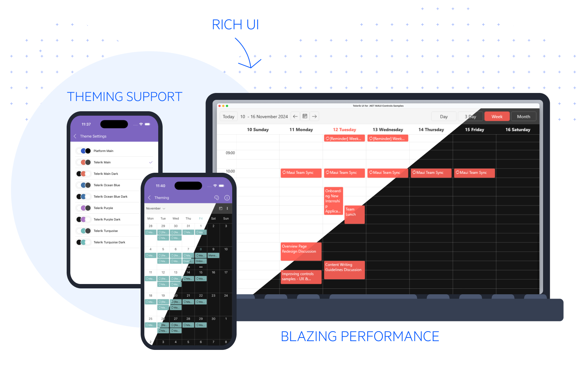
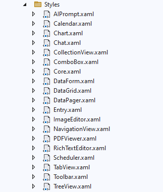

# Theming Support

Telerik UI for .NET MAUI comes with a built-in theme that controls the visual appearance of the components, including colors, borders, backgrounds, size, layout, position, and font size. The theme also offers multiple color variations to choose from.

>The built-in Telerik UI for .NET MAUI theme and its swatches were introduced in version 8.0.0 (2024 Q4) and are currently in preview.



## Theme

A *theme* is a collection of styles and templates in XAML files, which determine the appearance of the Telerik .NET MAUI components, including fonts, colors, sizes, and layouts. Furthermore, you can apply the theme's styles to other parts of your app and achieve visual consistency.

## Swatch

A *theme swatch* is a color variation of a theme. All swatches of a given theme use the same fonts, sizes, and layouts. On the other hand, the text colors, background colors, and border colors are different.

The Telerik .NET MAUI theme comes with a set of eight predefined swatches for both dark and light modes:

* Main 
* Main Dark 
* Ocean Blue 
* Ocean Blue Dark 
* Purple 
* Purple Dark 
* Turquoise 
* Turquoise Dark 

The next image shows the differences and similarities between the Purple and Purple Dark swatches when applied to the AutoComplete control.


>You can explore and compare the built-in theme swatches in the [Telerik .NET MAUI ControlsSamples App](). Go to the Theming example of each component and use the **Change Theme** button to switch between the theme swatches.

## Using the MAUI Theming

Before you can add Telerik Theming to your app, make sure that it is configured to use the Telerik UI for .NET MAUI components. For more details, see the [Getting Started with Telerik UI for .NET MAUI in Visual Studio]() or [Visual Studio Code]() articles.

**1.** Go to the `.csproj` file of your MAUI project and set `UseTelerikTheming` property to `true` in a separate `PropertyGroup`:

```XAML
<PropertyGroup>
    <UseTelerikTheming>true</UseTelerikTheming>
</PropertyGroup>
```

**2.** Rebuild the solution&mdash;this will generate a new `TelerikTheming` folder inside the project containing all the styles and resources needed for the Telerik .NET MAUI controls:

  

* The `Colors` folder contains the resources needed for each theme swatch in separate resource dictionaries. Note that the colors are referenced through dynamic resources, so you can update them at runtime.

  

* The `Styles` folder contains the styles and templates of the Telerik UI for .NET MAUI controls.

  * The styles are implemented through control-specific XAML files (see the next image).
  * The styles for all base controls that are used to build complex controls like the DataGrid are in the `Core.xaml` file.
  * The control templates in the XAML files are specific to the Telerik theme and differ from the default control templates of the Telerik UI for .NET MAUI controls.  

  

>important The files in the `TelerikTheming` folder are auto-generated. Use them only as a reference and do not modify them. See [Customizing the Telerik Theme]() for information on how to use these files to apply your own styles.

**3.** Go to the `App.xaml` file of your app and add the `TelerikTheming` resource dictionary to the application resources:

```XAML
<Application.Resources>
    <ResourceDictionary>
        <ResourceDictionary.MergedDictionaries>
            <ResourceDictionary Source="Resources/Styles/Colors.xaml" />
            <ResourceDictionary Source="Resources/Styles/Styles.xaml" />
            <local:TelerikTheming />
        </ResourceDictionary.MergedDictionaries>
    </ResourceDictionary>
</Application.Resources>
```

**4.** Set the `Telerik` theme and the desired swatch in the `App.xaml.cs` file. This example uses the `Purple` swatch:

```C#
var telerikTheming = Application.Current
                    .Resources
                    .MergedDictionaries
                    .OfType<TelerikTheming>()
                    .Single();
telerikTheming.Theme = TelerikTheming.Themes
                    .Single(t => t.Theme == "Telerik" && t.Swatch == "Purple");
```

The steps above apply the `Telerik` theme with its `Purple` swatch to the Telerik .NET MAUI components used across the app.

For example, if you have the following `RadToggleButton` control:

```XAML
<telerik:RadToggleButton x:Name="toggleButton"
                         Content="Wi-Fi" />
```

After applying the Purple swatch, the ToggleButton looks like this:


>Some of the Telerik UI for .NET MAUI controls do not fully support the Telerik theming yet. These are AIPrompt, Chart, DataPager, ImageEditor, SlideView, and Toolbar.

## Applying Theme Colors throughout the App

You can use the colors provided by the Telerik theme and its swatches Each theme swatch provides a set of colors that you can use in parts of your app that aren't Telerik components. This allows you to achieve a consistent look & feel.

For example, you can use the `RadAppSurfaceColor` and `RadOnAppSurfaceColor` colors for backround/text color respectively, and `RadPrimaryColor` for the accent color to match the appearance of the Telerik controls:

```XAML
<VerticalStackLayout Spacing="10" 
                     Padding="20"
                     BackgroundColor="{DynamicResource RadAppSurfaceColor}">
    <Label Text="Telerik .NET MAUI Theming" 
           FontSize="20"
           TextColor="{DynamicResource RadOnAppSurfaceColor}" />
    <BoxView Color="{DynamicResource RadPrimaryColor}"
            HeightRequest="4" />
    <Label Text="Telerik UI for .NET MAUI comes with a built-in theme that controls the visual appearance of the components." 
           FontSize="14"
           TextColor="{DynamicResource RadOnAppSurfaceColor}" />
    <telerik:RadToggleButton Content="Telerik Theming" 
                             HorizontalOptions="Start" />
</VerticalStackLayout>
```

Here is the result with the `Purple` and `Purple Dark` swatches applied:


## Changing the Theme Swatch Dynamically

You can take advantage of the available theme swatches and change them at runtime based on the device theme. This allows the application to respond to changes of the device theme from light to dark and the other way around. For more details on the suggested implementation, see the [Changing the Theme at Runtime]() KB article.

## Next Steps

* [Customizing the Telerik Theme]()
