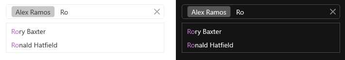
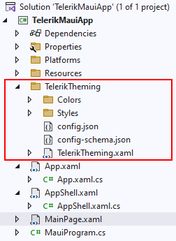
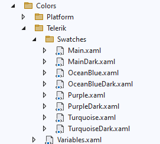
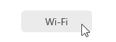
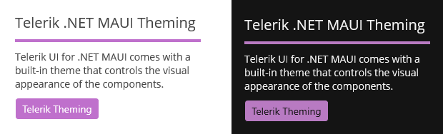

# Themes Overview

Telerik UI for .NET MAUI comes with a built-in theme that controls the visual appearance of the components, including colors, borders, backgrounds, size, layout, position, and font size. The theme also offers multiple color variations to choose from.

>The built-in Telerik UI for .NET MAUI theme and its swatches are currently in preview and were introduced in version 8.0.0 (2024 Q4).

## Theme

A *theme* is a collection of styles and templates in XAML files, which determine the appearance of the Telerik .NET MAUI components, including fonts, colors, sizes, and layouts.

## Swatch

A *theme swatch* is a color variation of a theme. All swatches of a given theme use the same fonts, sizes, and layouts. On the other hand, the text colors, background colors and border colors are different. For example, *Purple* and *Purple Dark* are two built-in swatch names.

The Telerik .NET MAUI theme comes with a set of eight predefined swatches for both dark and light modes: `Main`, `Main Dark`, `Ocean Blue`, `Ocean Blue Dark`, `Purple`, `Purple Dark`, `Turquoise` and `Turquoise Dark`.

Here is an example of the AutoComplete control with `Purple` and `Purple Dark` applied:



>You can explore and compare the built-in theme swatches in the [Telerik .NET MAUI ControlsSamples App](). Go to the Theming example of each component and use the **Change Theme** dropdown to switch between the theme swatches.

## Using the MAUI Themes

Before you can add Telerik Themes to your app, make sure that it is configured to use the Telerik UI for .NET MAUI components. For more details, see the [Getting Started with Telerik UI for .NET MAUI in Visual Studio]() or [Visual Studio Code]() articles.

**1.** Go to the `.csproj` file of your MAUI project and set `UseTelerikTheming` property to `true` in a separate `PropertyGroup`:

```XAML
<PropertyGroup>
    <UseTelerikTheming>true</UseTelerikTheming>
</PropertyGroup>
```

**2.** Rebuild the solution&mdash;this will generate a new `TelerikTheming` folder inside the project containing all the styles and resources needed for the Telerik .NET MAUI controls:



    * The `Colors` folder contains the resources needed for each theme swatch in separate resource dictionaries:

        

    * The `Styles` folder contains the styles and templates of the Telerik .NET MAUI controls (colors are referenced through dynamic resources, so you can update them at runtime).

**3.** Go to the `App.xaml` file of your app and add the `TelerikTheming` resource dictionary to the application resources:

    ```XAML
    <Application.Resources>
        <ResourceDictionary>
            <ResourceDictionary.MergedDictionaries>
                <ResourceDictionary Source="Resources/Styles/Colors.xaml" />
                <ResourceDictionary Source="Resources/Styles/Styles.xaml" />
                <local:TelerikTheming />
            </ResourceDictionary.MergedDictionaries>
        </ResourceDictionary>
    </Application.Resources>
    ```

    >important The files inside the **TelerikTheming** folder are auto-generated. Use them only as a reference, do not modify the resources directly here.

**4.** Set the `Telerik` theme and one of its color variations inside the `App.xaml.cs` file:

    ```C#
    var telerikTheming = Application.Current
                        .Resources
                        .MergedDictionaries
                        .OfType<TelerikTheming>()
                        .Single();
    telerikTheming.Theme = TelerikTheming.Themes
                        .Single(t => t.Theme == "Telerik" && t.Swatch == "Purple");
    ```

All the steps above apply the `Telerik` theme with `Purple` color variation to the Telerik .NET MAUI components used across the app.

For example, if you have the following `RadToggleButton` control:

```XAML
<telerik:RadToggleButton x:Name="toggleButton"
                         Content="Wi-Fi" />
```

After applying the `Telerik Purple` theme, the ToggleButton looks like this:



>Keep in mind some of the Telerik UI for .NET MAUI controls do not fully support the Telerik Theming - AIPrompt, Chart, DataPager, ImageEditor, SlideView and Toolbar.

### Applying Theme Colors throughout the App

Each color variation (theme swatch) provides a set of colors that you can use in parts of your app that aren't Telerik components. This allows you to achieve a consistent look & feel.

For example, you can use the `RadAppSurfaceColor` and `RadOnAppSurfaceColor` colors for backround/text color respectively, and `RadPrimaryColor` for the accent color to match the appearance of the Telerik controls:

```XAML
<VerticalStackLayout Spacing="10" 
                     Padding="20"
                     BackgroundColor="{DynamicResource RadAppSurfaceColor}">
    <Label Text="Telerik .NET MAUI Theming" 
           FontSize="20"
           TextColor="{DynamicResource RadOnAppSurfaceColor}" />
    <BoxView Color="{DynamicResource RadPrimaryColor}"
            HeightRequest="4" />
    <Label Text="Telerik UI for .NET MAUI comes with a built-in theme that controls the visual appearance of the components." 
           FontSize="14"
           TextColor="{DynamicResource RadOnAppSurfaceColor}" />
    <telerik:RadToggleButton Content="Telerik Theming" 
                             HorizontalOptions="Start" />
</VerticalStackLayout>
```

Here is the result with the `Purple` and `Purple Dark` swatches applied:



>Check the [Changing the Telerik Theme at runtime based on the device theme]() kb article which demonstrates how you can reload the Telerik theme according to the device theme.

## Next Steps

- [Customize the Telerik Theme]()
