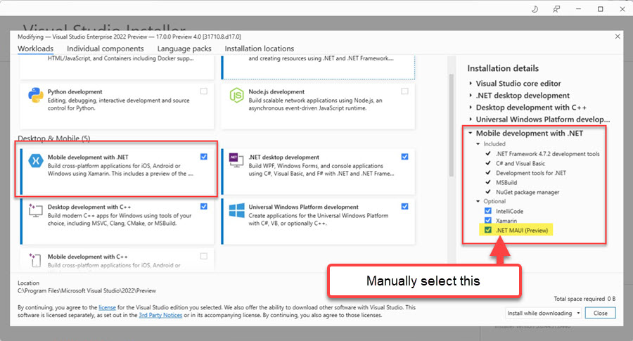
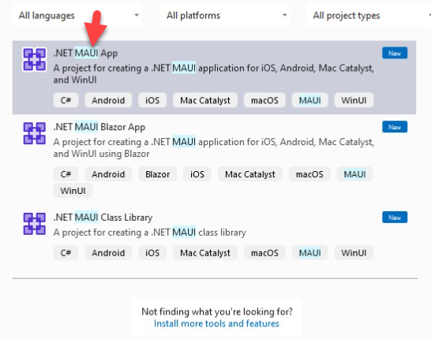
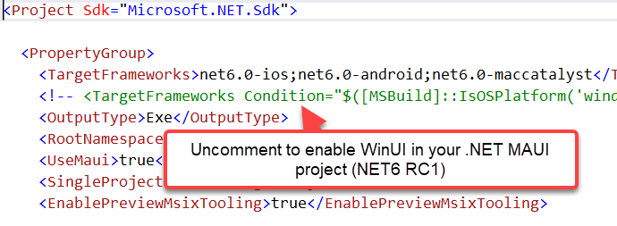
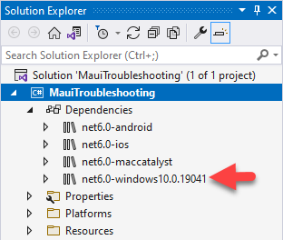
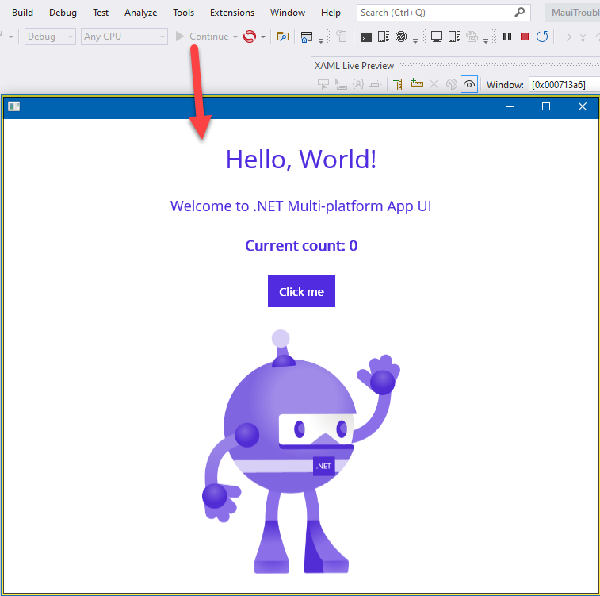

# Enabling the Windows Project

In .NET 6 RC1, you can use a single project for all the MAUI target platforms.

This means that you no longer need an external WinUI project. However, this functionality is not yet enabled by default and to implement it, you need to apply further configuration steps.

> Future Telerik UI for .NET MAUI releases of Visual Studio 2022 and .NET 6 intend to implement the auggested approach out of the box.

## Prerequisites

* Install Visual Studio 2022 Preview 4 with the .NET MAUI Workload. Make sure that under the **optional** section the .NET MAUI tools are selected. For detailed instructions, check out the official blog post on [updating the .NET Multi-Platform Application](https://devblogs.microsoft.com/dotnet/update-on-dotnet-maui/).

* Download and install the [Single Project MSIX Packaging Tools](https://marketplace.visualstudio.com/items?itemName=ProjectReunion.MicrosoftSingleProjectMSIXPackagingToolsDev17) VSExtension to Visual Studio 2022.

## Solution

1. Create a new .NET MAUI project on **Visual Studio** > **File** > **New project** > **.NET MAUI App**.

    

    On Android, iOS, MacCatalyst, and Windows, the new MAUI project is listed under the **Platforms** folder. However, the Windows Platform doesn't have a TFM enabled and you are not able to build and deploy a Windows application.

1. Enable the Windows TFM by manually editing the `.csproj` file and uncomment the following line:

    

1. Save the `csproj` file and let the project reload itself. After reloading, you can then see a `net6.0-windows10.0.19041` TFM in the dependencies list.

    

1. Now that you have a Windows platform in the project, configure Visual Studio to deploy. Expand the target platform and change to **Windows Machine**. Change the framework to `net6.0-windows10.0.19041`.

    

1. Build and deploy the WinUI project to the local PC.

    
